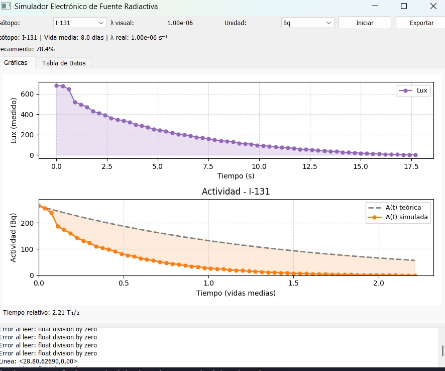
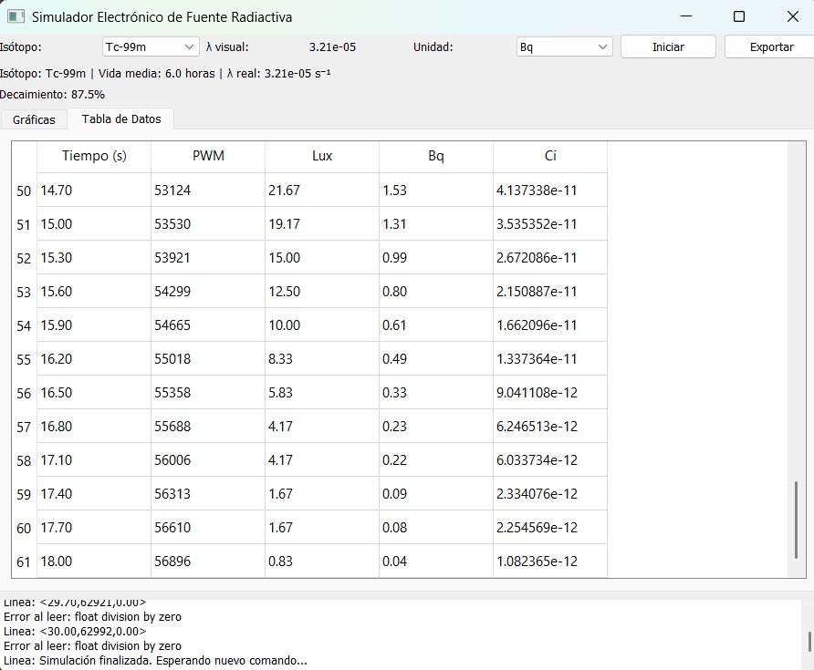
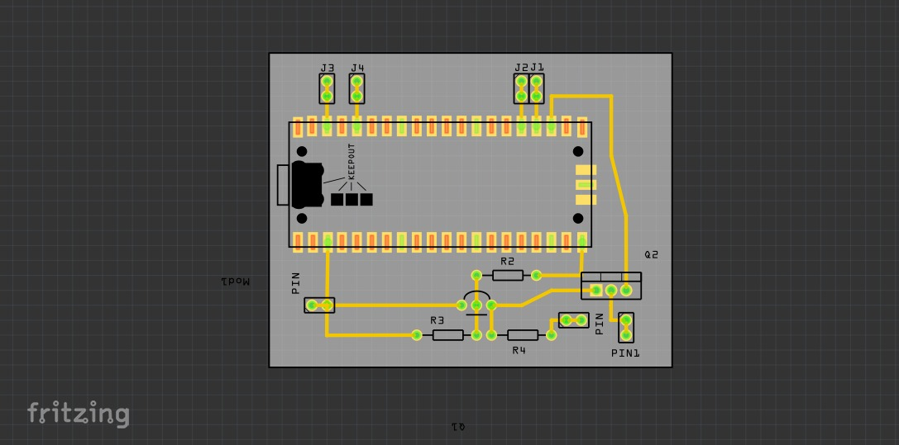

# ☢️ Simulador Electrónico de Fuente Radiactiva

Este repositorio contiene el hardware y software del proyecto "Simulador Electrónico de Fuente Radiactiva como Herramienta para la Enseñanza de la Física Nuclear", desarrollado en la Universidad Politécnica de Chiapas.

El sistema simula el decaimiento radiactivo de forma física y tangible, utilizando un **Raspberry Pi Pico** para controlar un LED de alta potencia (simulando la actividad) y una **aplicación de escritorio (PyQt5)** para controlar la simulación y visualizar los datos.

## 📜 Resumen del Proyecto

La enseñanza de la física nuclear se ve limitada por los desafíos logísticos y de seguridad del uso de fuentes radiactivas reales. Este proyecto presenta un simulador electrónico de bajo costo que proporciona un análogo físico del decaimiento radiactivo.

El núcleo es un **Raspberry Pi Pico** que controla la intensidad de un LED mediante PWM, programado para disminuir según la ley de decaimiento exponencial. La **aplicación de escritorio** permite al usuario seleccionar diferentes isótopos (como Tc-99m, I-131, Co-60) y escalas de tiempo, graficando en tiempo real la actividad teórica frente a la actividad simulada por el dispositivo.

## 📂 Estructura del Repositorio

* `/gui_desktop/`: Contiene la aplicación de escritorio (GUI) desarrollada en Python y PyQt5. Esta es la que se ejecuta en la PC.
* `/firmware_pico/`: Contiene el código (MicroPython) que debe cargarse en el Raspberry Pi Pico.
* `/hardware_3d/`: Contiene los archivos `.stl` para imprimir en 3D la carcasa del dispositivo.
* `/docs/`: Contiene el artículo de investigación (`.pdf`) que describe el proyecto.

---

## 🛠️ Stack Tecnológico

* **Hardware:** Raspberry Pi Pico, LED de alta potencia, Sensor de luz (para feedback), Carcasa 3D.
* **Firmware:** MicroPython (en el Pico).
* **Software (GUI):** Python, PyQt5, Matplotlib, PySerial.

---

## 🚀 Guía de Instalación y Uso

Este proyecto tiene dos partes: el **Firmware (Pico)** y la **GUI (PC)**.

### 1. Firmware (Raspberry Pi Pico)

1.  Asegúrate de tener [MicroPython flasheado](https://www.raspberrypi.com/documentation/microcontrollers/micropython.html) en tu Raspberry Pi Pico.
2.  Copia el archivo `firmware_pico/main.py` (y cualquier otro archivo .py de esa carpeta) a la memoria interna del Pico.
3.  Conecta el hardware (LED, sensor) a los pines GPIO correspondientes como se indica en el código del firmware.

### 2. GUI de Escritorio (PC)

1.  **Clona el repositorio:**
    ```bash
    git clone [https://github.com/TU-USUARIO/simulador-fuente-radiactiva.git](https://github.com/TU-USUARIO/simulador-fuente-radiactiva.git)
    cd simulador-fuente-radiactiva/gui_desktop
    ```

2.  **(Recomendado) Crea un entorno virtual:**
    ```bash
    python -m venv venv
    source venv/bin/activate  # En Windows: venv\Scripts\activate
    ```

3.  **Instala las dependencias:**
    (Asegúrate de tener un archivo `requirements.txt` en esta carpeta con `PyQt5`, `pyserial`, `matplotlib`).
    ```bash
    pip install -r requirements.txt
    ```

4.  **Ejecuta la aplicación:**
    * Conecta el Raspberry Pi Pico (ya cargado con el firmware) a tu PC vía USB.
    * Ejecuta el script `main.py` (tu archivo `main.orig.py` renombrado):
    ```bash
    python main.py
    ```
    * La aplicación debería detectar el puerto serial del Pico y conectarse.

---

## 📦 Hardware (Carcasa 3D)

La carpeta `/hardware_3d/` contiene los 3 archivos `.stl` necesarios para imprimir la carcasa del simulador:
* `base.stl`
* `taba_base.stl`
* `tapa_arriba.stl`

---

## 📸 Galería del Proyecto

<p align="center">
  
  <br>
  <em>Interfaz gráfica de control (PyQt5)</em>
</p>
<p align="center">
  
  <br>
  <em>Simulador en funcionamiento</em>
</p>
<p align="center">
  
  <br>
  <em>Circuito interno (Raspberry Pi Pico)</em>
</p>

## 📄 Publicación Académica  

Este proyecto fue presentado en las **Memorias del 5to Congreso Internacional de Tecnología y Ciencia Aplicada (CITCA)**, realizado en Cuernavaca, Morelos, México, del 26 al 28 de noviembre de 2025.  
El documento completo también se encuentra disponible en la carpeta `docs` de este repositorio:  

<p align="center">  
  <a href="docs/electronic_radioactive_source_simulator.pdf" target="_blank">  
      
    <br><em>Electronic Radioactive Source Simulator as a Tool for Teaching Nuclear Physics</em>  
  </a>  
</p>  
